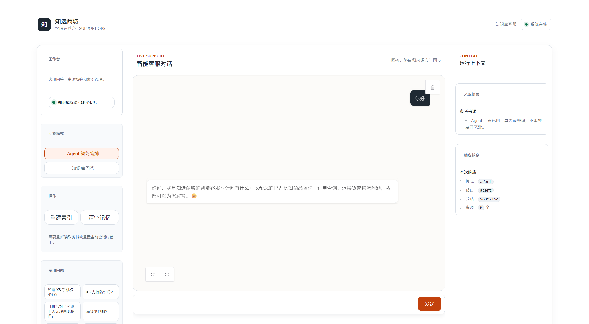

# 知选商城 · 智能客服 RAG Agent（LangChain 作业项目）

基于 **LangChain（1.x）+ 混合检索（向量 + BM25 + RRF）+ Agent 工具编排** 的电商客服问答系统。
用户可与 AI 进行多轮对话，AI 能自主判断调用「知识库检索」或「订单查询」工具完成回答。

---

## 一、功能一览

| 能力 | 说明 |
|---|---|
| RAG 知识库问答 | 商品规格 / 退换货 / 物流 / 发票 / 会员优惠 / 售后的文档问答 |
| 混合检索 | 向量检索（语义）+ BM25（关键词）双路召回，RRF 融合排序 |
| 中文切片 | Markdown 标题感知切片 + 递归字符切片，保留章节上下文 |
| Agent 编排 | LangChain `create_agent`，自带知识库工具与订单查询工具，自主选工具 |
| 多轮对话 | 会话记忆（chain 模式含查询改写；agent 模式直接带历史消息） |
| 订单查询 | 模拟订单/物流查询工具（业务场景演示，可换真实接口） |
| 双问答模式 | `agent`（智能编排，默认）/ `chain`（直接 RAG） |
| 引用溯源 | 后端返回 `sources` 字段便于核验；Web/CLI 对话内容不展示来源 |
| 可视化界面 | Gradio Web UI + 命令行 CLI |
| 评测 | 一键跑标准问题集的“检索命中率” |

## 二、界面演示



## 三、项目结构

```
知识库Agent/
├── app.py                  # Gradio Web 界面入口（python app.py）
├── cli.py                  # 命令行问答入口（python cli.py）
├── build_index.py          # 一键构建知识库索引
├── evaluate.py             # 检索命中率评测
├── requirements.txt        # conda 环境依赖清单
├── .env.example            # 配置模板（复制为 .env）
├── ScreenShot/
│   └── image.png            # Web 界面演示截图
├── data/
│   ├── raw/                # 知识库原始文档（Markdown，可自行增删）
│   └── orders_sample.json  # 模拟订单数据（订单查询工具使用）
├── kb_core/                # 核心代码
│   ├── config.py           # 配置（读取 .env）
│   ├── loader.py           # 文档加载（.md/.txt）
│   ├── splitter.py         # 自实现中文切片（标题感知 + 递归切分，零外部依赖）
│   ├── embeddings.py       # Embedding 抽象（openai/huggingface/debug）
│   ├── store.py            # 自实现轻量向量库（余弦检索 + JSON 持久化）
│   ├── bm25.py             # 自实现 BM25 关键词检索（jieba 分词，缺省自动回退）
│   ├── retriever.py        # 混合检索（向量 + BM25 + RRF 融合）
│   ├── rag.py              # 知识库问答：检索 + 生成（KnowledgeBase）
│   ├── order_tool.py       # 订单查询工具（业务数据）
│   ├── agent.py            # LangChain 1.x create_agent 编排
│   ├── history.py          # 会话记忆
│   ├── llm.py              # 模型接入
│   └── service.py          # 门面服务（统一入口）
├── tests/                  # 单元测试（python -m pytest tests -v）
└── runtime/                # 运行时生成（索引/向量），已 gitignore
```

## 四、环境准备（conda，重要）

本机已创建 conda 环境 `AI`，且已内置 langchain 1.x / langgraph / langchain-openai。
**本项目代码按 langchain 1.x API 编写**（`create_agent`），与网上 0.3 旧教程不同，勿混用。

```bash
conda activate AI
pip install -r requirements.txt -i https://pypi.tuna.tsinghua.edu.cn/simple
```

## 五、配置密钥

```bash
# Windows cmd
copy .env.example .env
# PowerShell
Copy-Item .env.example .env
```

打开 `.env` 至少配置 LLM（DeepSeek 示例已给出默认值，填上密钥即可）：

```
LLM_API_KEY=sk-你的DeepSeek密钥
```

**Embedding** 需单独配置：DeepSeek 官方不提供 embedding 接口，任选其一——
- 方案① 本机 Ollama：装好 [Ollama](https://ollama.com) 后 `ollama pull nomic-embed-text`，`.env` 保持默认即可；
- 方案② 阿里云百炼：用 `.env.example` 中注释的百炼配置（Qwen3.7 Embedding，批量上限 20）；
- 无任何密钥时：把 `EMBEDDING_PROVIDER=debug` 可离线跑通全流程（检索效果一般，仅演示用）。

## 六、运行步骤

```bash
# 1. 构建知识库索引（首次必须）
python build_index.py

# 2a. Web 界面
python app.py
#    浏览器打开 http://127.0.0.1:7860

# 2b. 或用命令行
python cli.py --mode agent
python cli.py --mode chain
```

Windows 也可双击 `启动_Windows.bat`（自动建索引 + 启动界面）。

## 七、可试问的问题

- 知选 X3 手机多少钱？支持防水吗？
- 耳机拆封了还能七天无理由退货吗？退货运费谁出？
- 满多少包邮？顺丰加急怎么收费？
- 能开发票吗？能开专票吗？
- 金卡会员有什么权益？积分怎么用？
- 手机屏幕摔碎了保修吗？
- 帮我查订单 XZ202401150001 的物流
- 你好，在吗？（测试闲聊不调工具）

多轮示例：先问「X3 手机多少钱」，再问「那它防水吗」（含“它”，考验对话理解）。

## 八、如何换成你自己的知识库 / 业务

1. 把业务文档（Markdown 最佳；政策、FAQ、说明书等）放入 `data/raw/`，支持多文件。
2. 重新运行 `python build_index.py`（增量场景可改造为按文件 sha1 去重后追加）。
3. 如需接入真实订单/业务系统：改写 `kb_core/order_tool.py` 中的 `check_order`，把本地 JSON 换成 HTTP 调用即可，Agent 无需改动。

## 九、测试与评测

```bash
python -m unittest tests.test_core -v   # 单元测试（零外部依赖，离线可跑）
python -m pytest tests -v               # 已安装 pytest 时同样可用
python evaluate.py                      # 检索命中率评测（仅需 embedding，离线可跑）
```

## 十、常见问题

| 问题 | 解决 |
|---|---|
| 报“未配置 LLM_API_KEY” | 复制 `.env.example` 为 `.env` 并填密钥 |
| Agent 创建失败 / 工具不可用 | 模型不支持 function calling，界面选「chain 模式」；或换 DeepSeek/Qwen 等支持工具的模型 |
| 检索效果差 | ① 配好真实 embedding（Ollama nomic / 百炼 v3），别用 debug；② 增大 `RAG_FINAL_TOP_K`；③ 文档标题用 `# / ##` 分节 |
| 想换向量库 | 替换 `kb_core/store.py` 的 `VectorStore` 内部实现即可（接口已与 Chroma/Milvus 对齐思路） |
| 端口被占用 | `python app.py` 里改 `server_port` |

## 十一、作业答辩要点（备查）

1. **架构**：文档加载 → 中文切片 → 双路向量化（语义+关键词）→ RRF 融合 → 生成；Agent 层做意图判断与工具编排。
2. **亮点**：混合检索 + RRF（单路向量检索对型号/政策编号类精确问题弱）；标题感知切片；引用溯源；双模式可对比实验。
3. **评测**：`evaluate.py` 给出检索命中率数据；可人工对比 agent/chain 两模式的回答质量。
4. **演进**：换 Chroma/Milvus、加 Rerank、接真实订单 API、用 RAGAS 做自动化评测。
